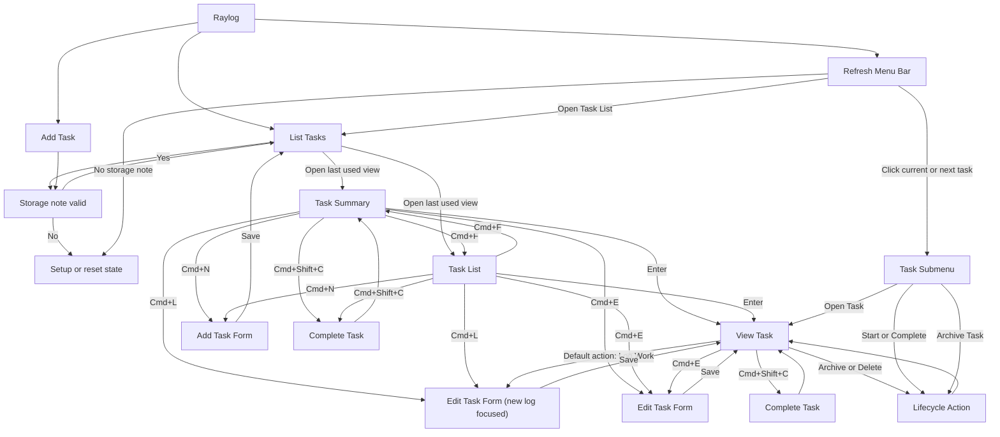

# Raylog

Focused task management in Raycast, backed by a single standalone markdown note.

Raylog is a compact Raycast extension for people who want fast local task capture
without adopting a larger notes or project-management stack. It stores tasks in
one markdown file, but the workflow is built entirely around Raycast.

## Features

- Status-driven task lifecycle: `To Do`, `In Progress`, `Done`, `Archived`
- Filtered list views for focused review instead of one long mixed list
- Urgency-aware ordering for active work
- Optional macOS menu bar task view for active work
- Configurable list metadata for due and start countdown indicators
- Quick actions for start, complete, reopen, archive, and delete
- Structured markdown-backed storage with resettable setup

## Workflow

### List Tasks

Use **List Tasks** to manage work from one command.

- Filter by `All Tasks`, `Open Tasks`, `To Do`, `In Progress`, `Due Soon`, `Done`, or `Archived`
- `Open Tasks` includes `To Do` and `In Progress`; `All Tasks` also includes `Done`
- Search task headers and bodies within the active view
- Use `Cmd+F` to switch between `Task Summary` and the full-width `Task List`
- The command reopens in the last list layout you used
- `Task Summary` shows the task body and work logs in the detail pane
- `Task List` shows each row as status, header, body preview, start date, and due date
- Use `Cmd+L` to jump straight into logging from the selected task
- Trigger lifecycle actions without leaving the list
- Open the form to edit or create tasks

### Add Task

Use **Add Task** to create a task with:

- **Header** (required)
- **Body**
- **Status**
- **Due Date**
- **Start Date**

### Refresh Menu Bar

Use **Refresh Menu Bar** to show your current Raylog task in the macOS menu bar.

- This feature is off by default until you enable the menu bar command in Raycast
- It only shows active tasks (`To Do` and `In Progress`)
- Clicking the current task or a task in the `Next 5 Tasks` section opens a task submenu
- The submenu lets you `Start Task`, `Complete Task`, `Archive Task`, or `Open Task`

To enable it:

1. Open Raycast and run `Refresh Menu Bar`
2. Activate the command in Raycast's built-in menu bar controls if prompted

To disable it:

1. Open Raycast settings for `Refresh Menu Bar`
2. Use Raycast's built-in `Deactivate` control for that menu bar command

### Window Flow

Raylog revolves around three entry commands plus a shared storage/setup gate
before the list and add-task flows can render.



## Storage Model

Raylog manages a JSON block inside your configured markdown note.

````md
<!-- raylog:start -->

```json
{
  "schemaVersion": 1,
  "tasks": []
}
```

<!-- raylog:end -->
````

Markdown outside the managed block is preserved. The managed block is intended to
be written by Raylog, not edited manually.

If the storage block is malformed or from an old schema, Raylog will prompt you
to reset the note to a fresh v1 document.

## Configuration

Set the **Storage Note** preference in Raycast to any existing `.md` file using
Raycast's native file picker in extension preferences. If no storage note is
configured, Raylog will direct you to extension preferences before the commands
can load. Once configured, Raylog will initialize the managed block
automatically when the file is empty or missing the Raylog block.

`List Tasks` also has command-specific preferences for:

- showing the due countdown indicator
- showing the start countdown indicator
- choosing how many days count as `Due Soon`

Large task sets are searched across the full datastore, while list rows are
loaded incrementally as you scroll so very large notes do not have to mount all
visible items at once.

## Troubleshooting

- If tasks do not load, verify that **Storage Note** points at the expected
  markdown file.
- If Raylog reports a schema or parse error, use the in-app reset action to
  reinitialize the managed block.
- If Raylog keeps returning to setup, open Raycast extension preferences and
  confirm that **Storage Note** still points at a valid markdown file.

## Development

Task list terminology:

- `All Tasks` is the default non-archived view
- `Open` is the queue of tasks still in the `Open` status
- `In Progress`, `Done`, and `Archived` map directly to their matching statuses

```bash
npm install
npm test
npm run lint
npm run build
```

To generate a large sibling datastore for stress testing without touching your
normal note:

```bash
npm run generate:stress-note -- /path/to/current-raylog.md --count 5000
```

This creates a new file next to the source note named like
`current-raylog.stress-5000.md` unless you pass `--output`.
