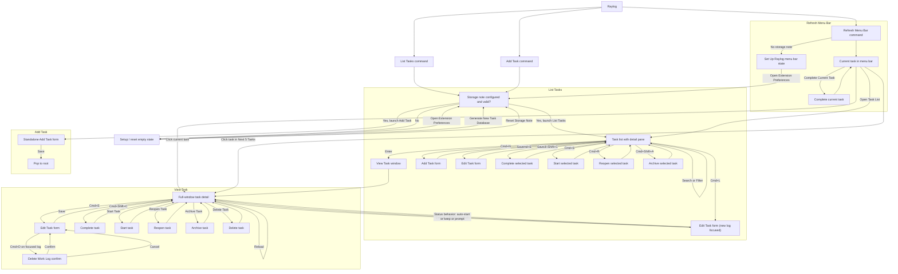

# Development Notes

## Window Flow

This diagram is the implementation-facing source of truth for Raylog's current
window and navigation flow. The automated test suite validates the Mermaid block
below so the documented flow stays aligned with the extension behavior.

